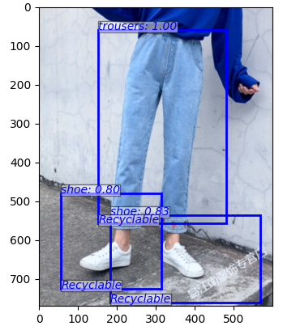
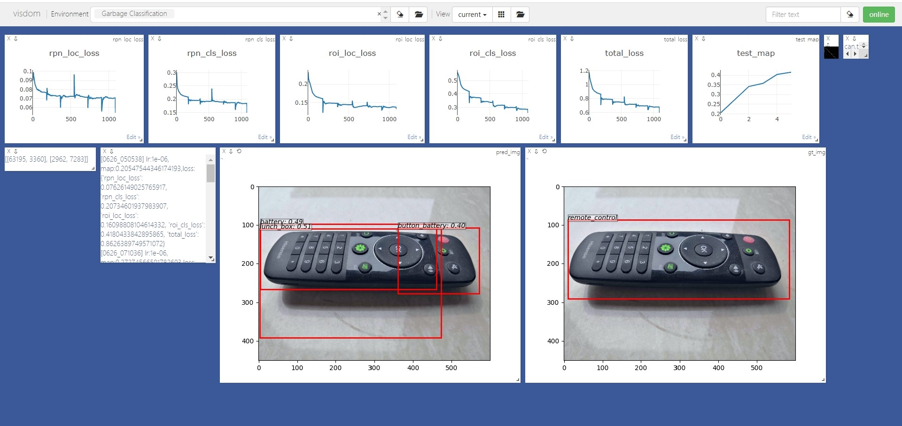

# Garbage Classification

## Introduction

A project of Garbage Classification with simple Faster-RCNN

The final homework of the scoure Deep Learning in ISE, SYSU.



**Tercher:** Liu Mengyuan

**Group Member:** Deng Kaiyuan, Deng Yushan, Ding Yuhao, Huang Zihao, Li Hengzhi

2021/06/30

In this project, we chose to perform object detection on images to achieve convenient and efficient garbage classification. So soon, a design using faster-rcnn as the main algorithm was born.

We have selected several common garbage in our lives and obtained a large number of images as the training set to try to obtain the best garbage recognition effect.

Limited by devices with relatively low performance, we have to make a trade-off between the scale and depth of the model to obtain a more appropriate hardware occupancy and training time. So, if you have more powerful equipment, you can try to replace the model used in this project and retrain.


## Performance


### Speed

|   GPU                 | Inference | Trainining | GPU Memory |
| :------:              | :-------: | :--------: | :---------:|
|   GeForce RTX 2060    |   3 fps   |     3 fps  | 3 GB |


make sure you install cupy correctly and only one program run on the GPU. The training speed is sensitive to your gpu status. Morever it's slow in the start of the program -- it need time to warm up.

It could be faster by removing visualization, logging, averaging loss etc.

## Install dependencies


- install PyTorch with GPU (code are GPU-only), refer to [official website](http://pytorch.org)

- install other dependencies:  `pip install visdom scikit-image tqdm fire ipdb pprint matplotlib torchnet` and `requirements.txt`

- command in cmd:
```Bash
python -m visdom.server
```

- start visdom for visualization, visit http://localhost:8097 in your browser and see the visualization of training procedure as below:




## Demo

Download pretrained model from [BaiduDisk](https://pan.baidu.com/s/12NLSy-7zsNpuYNoeJjj_wA) with password：b02h

See [Demo_pro.ipynb](https://github.com/IT-BillDeng/Garbage-Classification/blob/main/Demo_pro.ipynb) for more detail.

## Train

### Prepare data

#### Trash Dataset

1. Download the training, validation, test data from [BaiduDisk](https://pan.baidu.com/s/1W4wlNRcoKwWknLadtDHlvg) with password：b4gv

   

2. Unzip it to the right address, and set `--Trash_data_dir` in `utils/config.py`


### begin training

You may refer to `utils/config.py` for more argument.

Some Key arguments:


- `--plot-every=n`: visualize prediction, loss etc every `n` batches.
- `--env`: visdom env for visualization
- `--Trash_data_dir`: where the Trash data stored
- `--use-drop`: use dropout in RoI head, default False
- `--use-Adam`: use Adam instead of SGD, default SGD. (You need set a very low `lr` for Adam)
- `--load-path`: pretrained model path, default `net/net.pth`, if it's specified, it would be loaded. If you want to train another new model, set it `None`.
- `--standard`: The standard of Garbage Classification in which city. Now only surport city `Shenzhen`.

You may open browser, visit `http://<localhost>:8097` and see the visualization of training procedure.

## Acknowledgement
This work builds on many excellent works, which include:

- [Chenyun's simple-faster-rcnn-pytorch](https://github.com/chenyuntc/simple-faster-rcnn-pytorch)(mainly)
- [Yusuke Niitani's ChainerCV](https://github.com/chainer/chainercv) 
- [Ruotian Luo's pytorch-faster-rcnn](https://github.com/ruotianluo/pytorch-faster-rcnn) which based on [Xinlei Chen's tf-faster-rcnn](https://github.com/endernewton/tf-faster-rcnn)
- [faster-rcnn.pytorch by Jianwei Yang and Jiasen Lu](https://github.com/jwyang/faster-rcnn.pytorch).It mainly refer to [longcw's faster_rcnn_pytorch](https://github.com/longcw/faster_rcnn_pytorch)
- All the above Repositories have referred to [py-faster-rcnn by Ross Girshick and Sean Bell](https://github.com/rbgirshick/py-faster-rcnn)  either directly or indirectly. 

